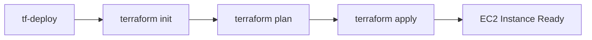
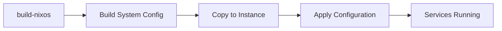
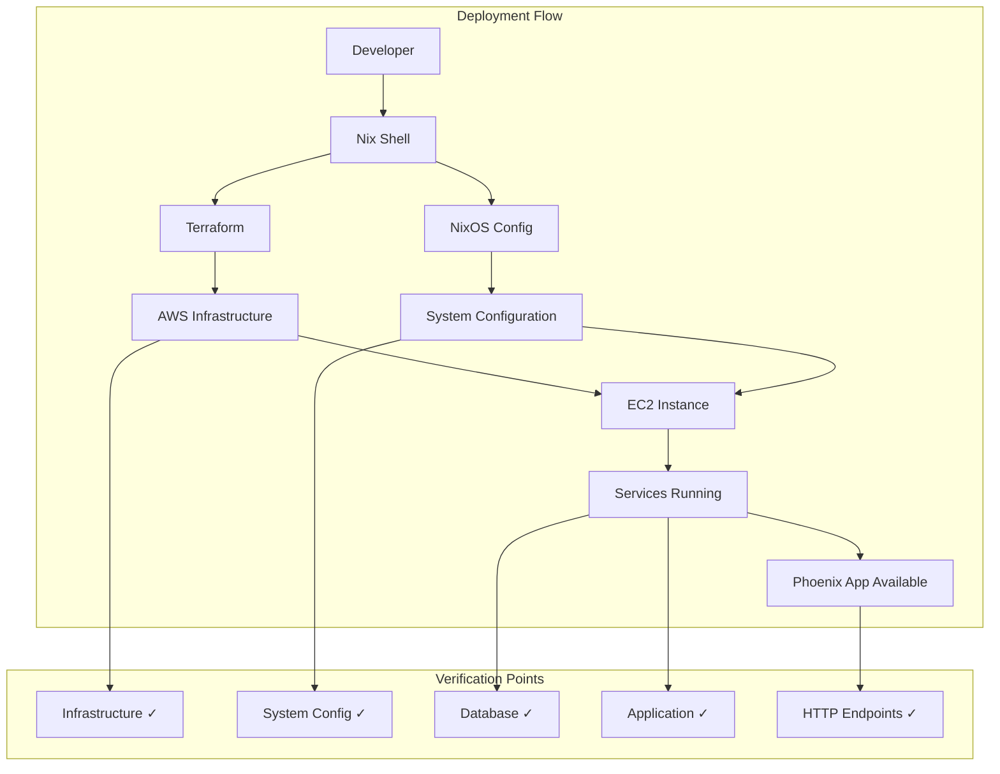

# Deployment Guide

## Prerequisites

### 1. AWS Account Setup
- AWS account with appropriate permissions
- AWS CLI configured with credentials
- EC2 Key Pair created in your target region

### 2. Local Environment
- Nix package manager installed
- Git repository cloned
- direnv installed (optional but recommended)

## Step-by-Step Deployment

### Phase 1: Environment Preparation

```bash
# 1. Enter the project directory
cd inventary_traker

# 2. Enter Nix development shell
nix develop
# This loads: Terraform, AWS CLI, Phoenix, PostgreSQL, custom scripts

# 3. Configure Terraform variables
cp terraform.tfvars.example terraform.tfvars
```

Edit `terraform.tfvars`:
```hcl
aws_region    = "us-east-1"        # Your preferred AWS region
instance_type = "t2.micro"         # Free tier eligible
key_name      = "your-key-pair"    # Your EC2 key pair name
```

### Phase 2: Infrastructure Deployment



```bash
# 4. Deploy AWS infrastructure
tf-deploy

# This will:
# - Initialize Terraform
# - Plan the deployment
# - Create EC2 instance with security groups
# - Run user_data.sh for initial setup
```

**Expected Output:**
```
Terraform deployment complete!
instance_id = "i-1234567890abcdef0"
public_ip = "18.234.567.89"
public_dns = "ec2-18-234-567-89.compute-1.amazonaws.com"
```

### Phase 3: System Configuration



```bash
# 5. Build NixOS system configuration
build-nixos

# 6. Get your instance IP from Terraform output
export INSTANCE_IP=$(terraform output -raw public_ip)

# 7. Copy your SSH public key to the instance (if not done during creation)
ssh-copy-id -i ~/.ssh/your-key.pub admin@$INSTANCE_IP

# 8. Copy the built configuration to the instance
scp -r result admin@$INSTANCE_IP:/tmp/nixos-config

# 9. SSH into the instance and apply the configuration
ssh admin@$INSTANCE_IP

# On the remote instance:
sudo nix-env -iA nixos.nixos-rebuild
sudo nixos-rebuild switch -I nixos-config=/tmp/nixos-config
```

### Phase 4: Application Deployment

```bash
# 10. Create application directory and set permissions
sudo mkdir -p /opt/inventory-tracker
sudo chown deploy:deploy /opt/inventory-tracker

# 11. Clone your Phoenix application
git clone https://github.com/your-username/inventory-tracker.git /opt/inventory-tracker
cd /opt/inventory-tracker

# 12. Install Phoenix dependencies and setup database
mix deps.get --only prod
mix ecto.create
mix ecto.migrate

# 13. Compile assets and application
mix assets.deploy
mix phx.digest
mix compile

# 14. Start the systemd service
sudo systemctl enable inventory-tracker
sudo systemctl start inventory-tracker
```

### Phase 5: Verification

```bash
# 15. Check service status
sudo systemctl status inventory-tracker
sudo systemctl status postgresql
sudo systemctl status nginx

# 16. Test application endpoints
curl http://$INSTANCE_IP/
curl http://$INSTANCE_IP/health

# 17. Check logs if needed
sudo journalctl -u inventory-tracker -f
sudo journalctl -u nginx -f
```

## Deployment Verification Checklist

### Infrastructure Verification
- [ ] EC2 instance is running
- [ ] Security groups allow required ports (22, 80, 443, 4000)
- [ ] Elastic IP assigned (if configured)
- [ ] SSH access working with key-based authentication

### System Configuration Verification
- [ ] Nix package manager installed
- [ ] PostgreSQL service running
- [ ] Nginx service running
- [ ] Deploy user created with correct permissions

### Application Verification
- [ ] Phoenix application starts without errors
- [ ] Database connection successful
- [ ] HTTP endpoints responding
- [ ] WebSocket connections working (if applicable)
- [ ] Static assets served correctly

## Deployment Architecture



## Troubleshooting

### Common Issues

#### 1. Terraform Deployment Fails
```bash
# Check AWS credentials
aws sts get-caller-identity

# Verify key pair exists
aws ec2 describe-key-pairs --key-names your-key-pair

# Check region configuration
aws configure list
```

#### 2. SSH Connection Issues
```bash
# Test SSH connection
ssh -i ~/.ssh/your-key.pem admin@$INSTANCE_IP

# Check security group rules
aws ec2 describe-security-groups --group-names inventory-tracker-sg
```

#### 3. Phoenix Application Won't Start
```bash
# Check logs
sudo journalctl -u inventory-tracker -n 50

# Verify database connection
sudo -u deploy psql -d inventory_tracker -c "\dt"

# Check environment variables
sudo systemctl show inventory-tracker --property=Environment
```

#### 4. Database Connection Issues
```bash
# Check PostgreSQL status
sudo systemctl status postgresql

# Test local connection
sudo -u postgres psql -c "\l"

# Verify database and user exist
sudo -u postgres psql -c "SELECT datname FROM pg_database;"
```

#### 5. Nginx Proxy Issues
```bash
# Check Nginx configuration
sudo nginx -t

# Check upstream connection
curl -I http://localhost:4000

# Verify proxy configuration
sudo cat /etc/nginx/sites-available/default
```

## Rollback Procedures

### Infrastructure Rollback
```bash
# Destroy current infrastructure
tf-destroy

# Revert to previous Terraform state (if needed)
terraform state list
terraform state pull > backup.tfstate
```

### Application Rollback
```bash
# Stop services
sudo systemctl stop inventory-tracker
sudo systemctl stop nginx

# Revert to previous application version
git checkout previous-working-commit
mix deps.get --only prod
mix compile

# Restart services
sudo systemctl start inventory-tracker
sudo systemctl start nginx
```

## Production Considerations

### Security Hardening
- [ ] Change default PostgreSQL passwords
- [ ] Configure SSL certificates (Let's Encrypt)
- [ ] Set up proper firewall rules
- [ ] Enable fail2ban for SSH protection
- [ ] Configure log rotation

### Performance Optimization
- [ ] Configure PostgreSQL connection pooling
- [ ] Set up Nginx caching
- [ ] Configure Phoenix clustering (if needed)
- [ ] Set up monitoring and alerting

### Backup Strategy
- [ ] Automated database backups to S3
- [ ] Application code versioning
- [ ] Infrastructure state backups
- [ ] Regular disaster recovery testing

### Monitoring Setup
- [ ] CloudWatch metrics and alarms
- [ ] Application performance monitoring
- [ ] Log aggregation and analysis
- [ ] Health check endpoints

## Environment-Specific Configurations

### Development Environment
```bash
# Use local development database
export DATABASE_URL="postgresql://localhost/inventory_tracker_dev"
export MIX_ENV=dev
mix phx.server
```

### Staging Environment
```bash
# Deploy to staging with different variables
cp terraform.tfvars terraform.tfvars.staging
# Edit staging-specific values
tf-deploy -var-file="terraform.tfvars.staging"
```

### Production Environment
```bash
# Production deployment with additional security
# - Use SSL certificates
# - Configure monitoring
# - Set up backups
# - Enable high availability (if required)
```

## Maintenance

### Regular Tasks
- Weekly security updates: `apt update && apt upgrade`
- Database maintenance: `VACUUM` and `ANALYZE`
- Log rotation and cleanup
- Backup verification
- Performance monitoring review

### Updates and Patches
```bash
# Update system configuration
build-nixos
# Copy and apply new configuration

# Update application
git pull origin main
mix deps.get --only prod
mix compile
sudo systemctl restart inventory-tracker
```