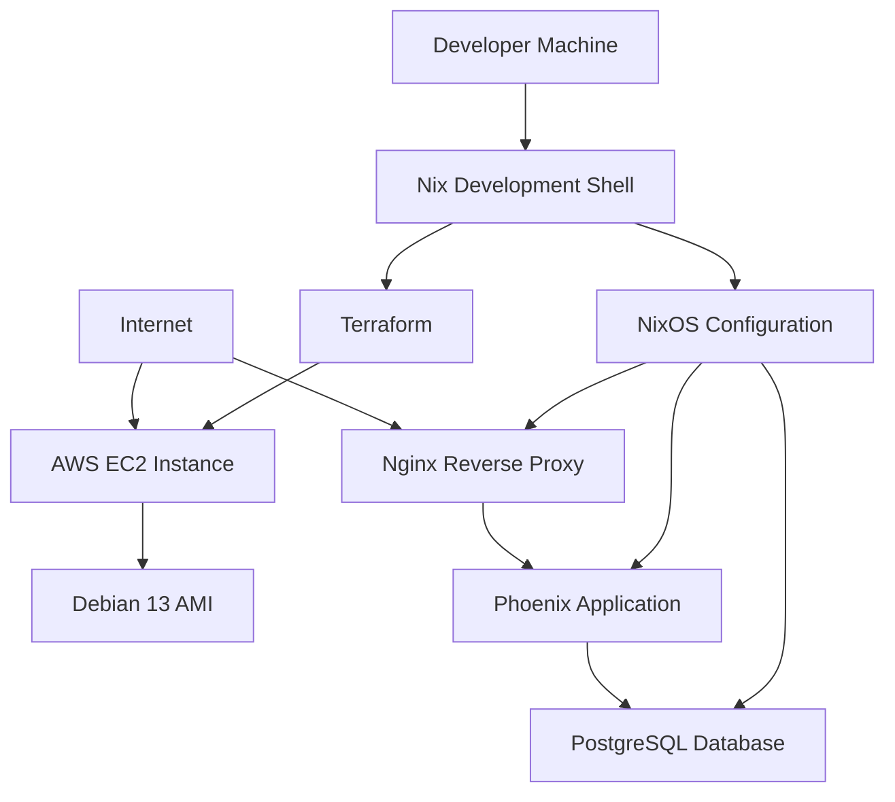
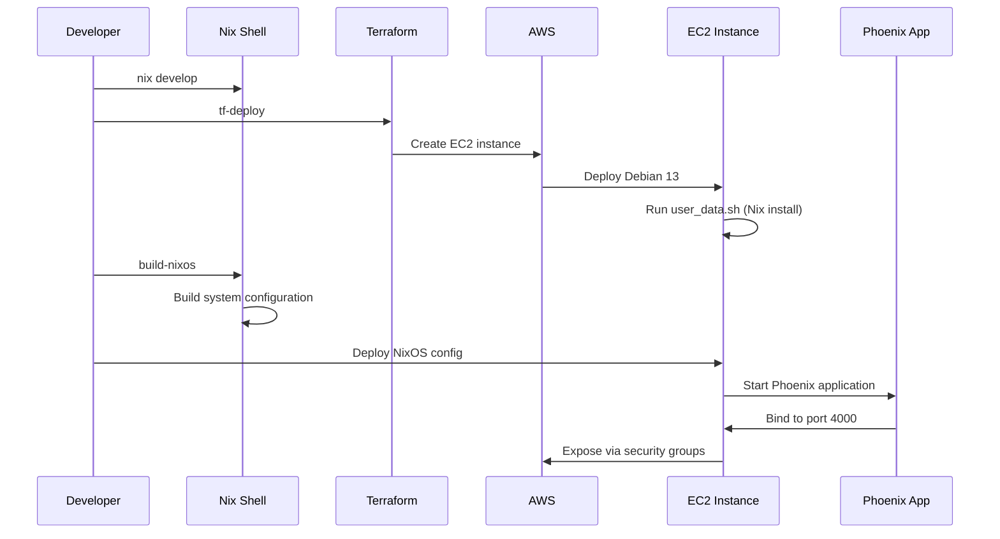
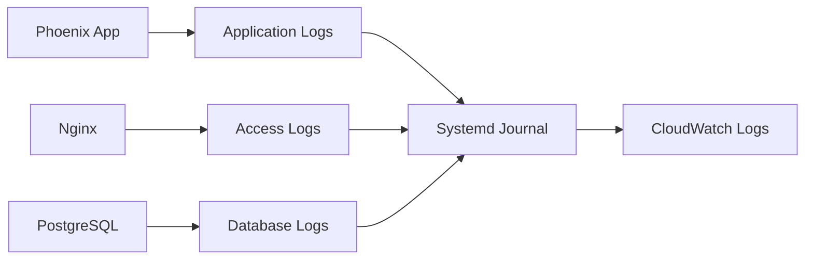

# Infrastructure Setup Documentation

## Overview

This project uses a modern infrastructure setup combining **Terraform** for AWS resource provisioning, **NixOS** for system configuration, and **Nix flakes** for development environment management.

## Architecture



## Components

### 1. Development Environment (Nix Flake)

The `flake.nix` provides a complete development environment with:

- **Phoenix/Elixir** development stack
- **Terraform** for infrastructure provisioning
- **AWS CLI** for cloud management
- **Custom scripts** for deployment automation

### 2. Infrastructure as Code (Terraform)

Located in `main.tf`, this defines:

- **EC2 Instance**: `t2.micro` (free tier eligible)
- **Security Groups**: SSH (22), HTTP (80), HTTPS (443), Phoenix (4000)
- **AMI**: Debian 13 (`ami-0bb7d855677353076`)
- **User Data**: Initial system setup with Nix installation

### 3. System Configuration (NixOS)

The `nixos/configuration.nix` provides:

- **Phoenix Application** environment
- **PostgreSQL** database setup
- **Nginx** reverse proxy configuration
- **Systemd services** for application management

## Infrastructure Flow



## Available Commands

### Development Commands
```bash
# Enter development environment
nix develop

# Phoenix development
mix deps.get        # Install dependencies
mix ecto.create     # Create database
mix ecto.migrate    # Run migrations
mix phx.server      # Start Phoenix server
```

### Infrastructure Commands
```bash
# Terraform deployment
tf-deploy           # Deploy AWS infrastructure
tf-destroy          # Destroy AWS infrastructure

# NixOS configuration
build-nixos         # Build NixOS system configuration
deploy              # Show deployment steps
```

## File Structure

```
inventary_traker/
├── flake.nix                 # Nix development environment
├── main.tf                   # Terraform AWS infrastructure
├── terraform.tfvars.example # Terraform variables template
├── user_data.sh             # EC2 initialization script
├── nixos/
│   └── configuration.nix    # NixOS system configuration
├── nixops/                  # Legacy NixOps files (reference)
│   ├── network.nix
│   └── inventory-tracker.nix
└── INFRASTRUCTURE.md        # This documentation
```

## Security Configuration

### Network Security
- **Security Groups**: Restrict access to necessary ports only
- **SSH Access**: Key-based authentication, no root login
- **HTTPS Ready**: Port 443 open for SSL termination

### Application Security
- **Database**: Local PostgreSQL with restricted access
- **Environment Variables**: Secure secret management
- **User Isolation**: Dedicated `deploy` user for applications

## Cost Optimization

### AWS Free Tier Usage
- **Instance Type**: `t2.micro` (750 hours/month free)
- **Storage**: 8GB EBS (30GB free tier)
- **Data Transfer**: Within free tier limits

### Resource Management
- **Spot Instances**: Optional for cost reduction
- **Auto-scaling**: Not implemented (single instance)
- **Monitoring**: Basic CloudWatch (free tier)

## Monitoring and Logs



## Backup Strategy

### Database Backups
- **Automated**: PostgreSQL continuous archiving
- **Manual**: `pg_dump` scheduled backups
- **Storage**: S3 for long-term retention

### Application Backups
- **Code**: Git repository (version controlled)
- **Configuration**: NixOS reproducible builds
- **Data**: Application-specific backup strategies

## Disaster Recovery

### Infrastructure Recovery
1. **Terraform**: `tf-deploy` recreates entire infrastructure
2. **NixOS**: Reproducible system configuration
3. **Data**: Restore from backups

### Application Recovery
1. **Deploy**: New EC2 instance via Terraform
2. **Configure**: Apply NixOS configuration
3. **Restore**: Database and application data
4. **DNS**: Update DNS records if needed

## Development Workflow

### Local Development
1. `nix develop` - Enter development environment
2. Local PostgreSQL for development
3. Phoenix server on `localhost:4000`

### Staging Deployment
1. `tf-deploy` - Create AWS infrastructure
2. `build-nixos` - Build system configuration
3. Deploy configuration to staging instance
4. Test application functionality

### Production Deployment
1. Validate staging deployment
2. Apply same configuration to production
3. Database migrations
4. DNS cutover
5. Monitor application health